# Deepfake Detection System - Architecture Overview

## System Architecture

This document describes the architecture of the Agentic AI Deepfake Detection & Authenticity Verification System.

## High-Level Architecture

## Component Architecture

### 1. Edge Agent Architecture

### 2. ML Model Architecture

#### Video Detection Model

#### Audio Detection Model

### 3. Security Architecture

### 4. Continuous Learning Pipeline

## Data Flow

### Real-Time Detection Flow

### Model Update Flow

## Deployment Architecture

### Cloud Deployment (Kubernetes)

```mermaid
graph TB
    subgraph "Ingress Layer"
        A[Load Balancer]
        B[API Gateway]
    end
    
    subgraph "Application Layer"
        C1[Detection Service<br/>Pod x3]
        C2[Model Service<br/>Pod x2]
        C3[Auth Service<br/>Pod x2]
    end
    
    subgraph "Data Layer"
        D1[(PostgreSQL<br/>Primary)]
        D2[(PostgreSQL<br/>Replica)]
        D3[(Redis Cache)]
    end
    
    subgraph "Storage Layer"
        E1[Model Storage<br/>S3/Blob]
        E2[Media Storage<br/>S3/Blob]
    end
    
    A --> B
    B --> C1
    B --> C2
    B --> C3
    C1 --> D1
    C2 --> D1
    C3 --> D1
    D1 --> D2
    C1 --> D3
    C2 --> E1
    C1 --> E2
```

### Edge Deployment

## Technology Stack

### Edge Agent
- **Language**: C++ (core), Kotlin/Swift (mobile)
- **ML Runtime**: TensorFlow Lite, ONNX Runtime
- **Security**: OpenSSL, Platform Keychains
- **Database**: SQLite
- **Build**: CMake, Gradle, Xcode

### Cloud Services
- **Language**: Python 3.11+
- **Framework**: FastAPI, SQLAlchemy
- **ML**: TensorFlow, PyTorch, Hugging Face
- **Database**: PostgreSQL 15+, Redis
- **Deployment**: Docker, Kubernetes
- **Monitoring**: Prometheus, Grafana

### ML Models
- **Video**: EfficientNet-B0, 3D CNN
- **Audio**: Wav2Vec2, BiLSTM
- **Compression**: TFLite Quantization (INT8, FP16)
- **Training**: Mixed Precision, Distributed Training

## Performance Targets

| Metric | Target | Notes |
|--------|--------|-------|
| **Edge Inference Latency** | | |
| Audio (10s clip) | <500ms | On mid-range smartphone |
| Video (10s clip) | <2s | 5 FPS sampling |
| **Accuracy** | | |
| Audio Detection | >95% | On FakeAVCeleb dataset |
| Video Detection | >93% | On DFDC dataset |
| **Resource Usage** | | |
| Memory (Edge) | <200MB | Peak usage |
| Power (Edge) | <100mW | Average during detection |
| Model Size | <50MB | Combined audio + video |
| **Availability** | | |
| Cloud API | 99.9% | SLA target |
| Edge Offline | 100% | No cloud dependency |

## Security Considerations

### Threat Model

1. **Adversarial Attacks**: Models hardened against adversarial examples
2. **Model Extraction**: Encrypted model files, obfuscated code
3. **Data Exfiltration**: End-to-end encryption, local processing
4. **Firmware Tampering**: Secure boot, code signing
5. **Unauthorized Access**: RBAC, MFA, biometric authentication

### Compliance

- **Data Privacy**: GDPR, CCPA compliant
- **Cryptography**: FIPS 140-2 validated modules
- **Audit**: Complete audit trail for all detections
- **Retention**: Configurable data retention policies

## Scalability

### Horizontal Scaling
- Cloud services: Auto-scaling based on load
- Database: Read replicas, sharding
- Model serving: Model parallelism

### Vertical Scaling
- Edge devices: Adaptive quality based on hardware
- Cloud: GPU acceleration for batch processing

## Future Enhancements

1. **Multi-language Support**: Detection for non-English content
2. **Live Stream Analysis**: Real-time video stream processing
3. **Explainability**: Visual heatmaps showing manipulation regions
4. **Federation**: Federated learning across edge devices
5. **Blockchain**: Immutable audit trail using blockchain
